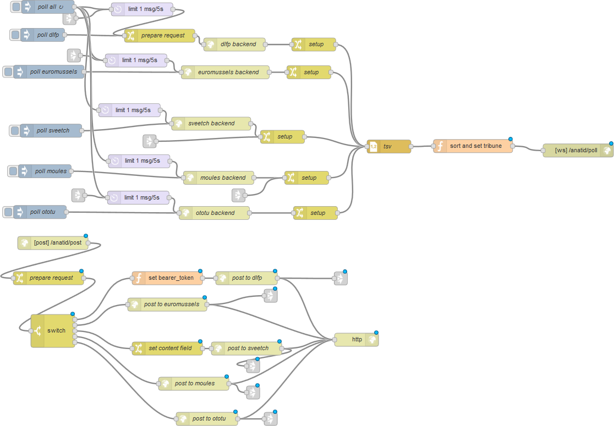

# anatid

anatid is a node-red tribune proxy.



## Endpoints

Anatid exposes two endpoint for polling and posting tribune messages.

### /anatid/poll

```javascript
var ws = new WebSocket("ws://localhost:8000/anatid/poll", "anatid");
ws.onmessage = function (event) {
  console.log(event.data);
};
```

### /anatid/post

```bash
curl -X POST -d "message=plop" 'http://localhost:8000/anatid/post'
```